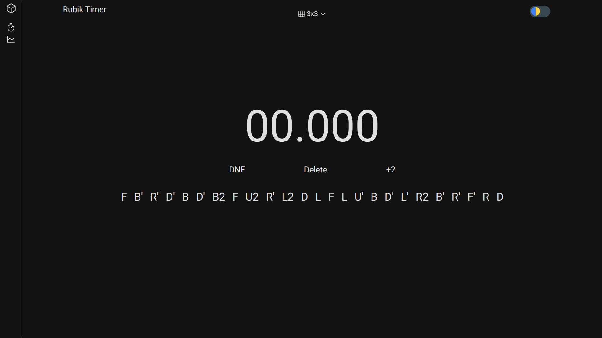

# RubikTimer

A modern, lightweight Rubik's Cube timer built with HTML, CSS, and vanilla JavaScript.

## Features

- ⏱️ **Precise Timer** with Spacebar support
- 🎲 **Scramble Generator** for 2×2 and 3×3 cubes
- 📊 **Statistics** including Ao5, Ao12, Ao25, Ao50, Ao100, and best solve
- 📝 **Solve Management**: DNF, +2, Delete, and solve details (scramble & date)
- 🌙 **Light & Dark Theme** with saved user preference
- 📂 **Collapsible Sidebar** and Focus Mode for distraction-free timing
- 💾 **Local Storage** — all solves are automatically saved in your browser
-    📱 **Clean, responsive, and minimal UI**

## Roadmap

- [ ] Add charts to the Statistics page
- [ ] Import / Export solves

