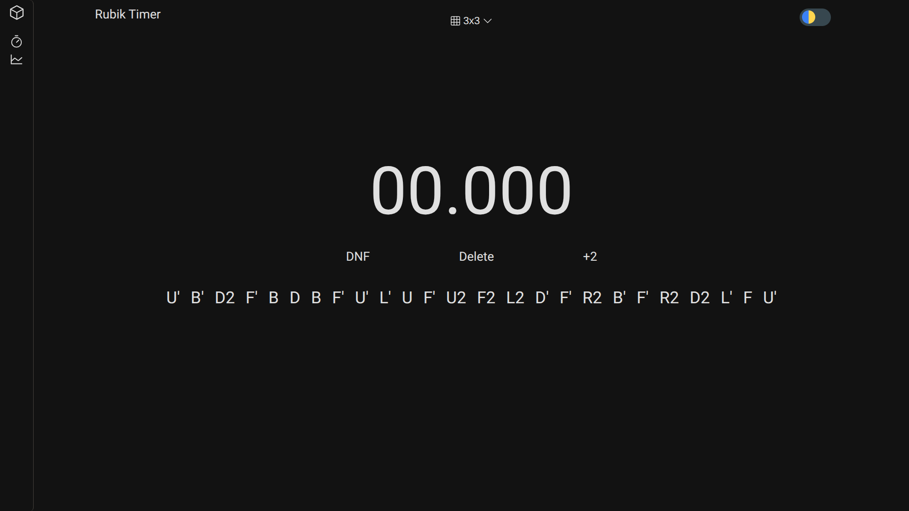
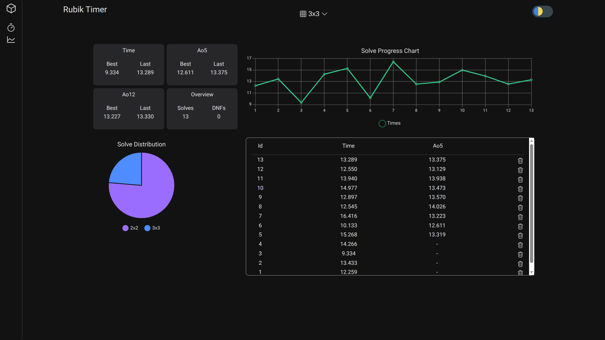

# RubikTimer

A modern, lightweight Rubik's Cube timer for tracking solves, generating scrambles, and analyzing performance.




## Features

- ⏱️ Precise Rubik's Cube timer
- 🎲 2×2 and 3×3 scramble generation
- 📊 Solve tracking with configurable averages
- 📈 Statistics and performance charts
- 🌙 Light and dark themes

## Tech Stack

- HTML5 + CSS3 (Design Tokens)
- Vanilla JavaScript (ES Modules)
- [Chart.js](https://www.chartjs.org/)

## Getting Started

Clone the repository and start a local server:

```bash
git clone https://github.com/rshd0/RubikTimer.git
cd RubikTimer
python -m http.server
```

Then open [http://localhost:8000](http://localhost:8000) in your browser.

## Roadmap

- [ ] Import / Export solves
- [ ] Inspection time (15s WCA)
- [ ] More cube types

## License

MIT